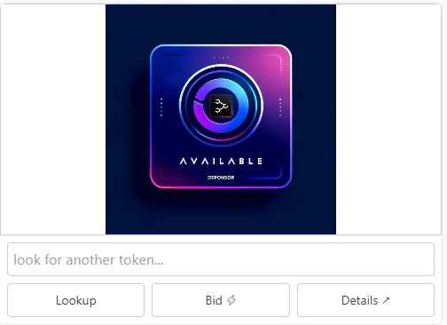

# DSponsor Relayer

The Relayer App provides API endpoints and UI components for the [DSponsor ecosystem](https://dsponsor.com). It processes and transforms on-chain data indexed by the [DSponsor subgraph](https://github.com/dcast-media/dsponsor-subgraph) deployed on The Graph Network.

- [DSponsor Relayer](#dsponsor-relayer)
  - [Development setup](#development-setup)
  - [Caching strategy](#caching-strategy)
    - [Front end usage](#front-end-usage)
  - [Integrations](#integrations)
    - [Generic](#generic)
      - [Get image for a specific token](#get-image-for-a-specific-token)
      - [Get link for a specific token](#get-link-for-a-specific-token)
    - [Clickable Logos Grid](#clickable-logos-grid)
      - [Iframe](#iframe)
      - [HTML table](#html-table)
    - [Dynamic Banner](#dynamic-banner)
      - [Dynamic Banner Iframe](#dynamic-banner-iframe)
      - [Warpcast Frame](#warpcast-frame)
        - [Warpcast Frame Parameters Details](#warpcast-frame-parameters-details)
      - [Warpcast Frame Response](#warpcast-frame-response)
      - [Image only](#image-only)
  - [API endpoints](#api-endpoints)
    - [Get a sponsor's ad spaces](#get-a-sponsors-ad-spaces)
    - [Users activity](#users-activity)
    - [Ad spaces data for an offer](#ad-spaces-data-for-an-offer)
    - [Graph proxy](#graph-proxy)
    - [Price quote](#price-quote)
    - [Token metadata](#token-metadata)

## Development setup

1. Create and complete a `.env.local` file:

```env
# required
NEXT_ALCHEMY_API_KEY=xxxxxxxx

# from src/config, you may need it
NEXT_DEV_URL=http://localhost:3000
SUBGRAPH_ALCHEMY_KEY=xxxxx
THEGRAPH_API_KEY=xxxxxxxxxx

# optionnal
NEXT_CACHE_LOGS=datacache,verbose
```

2. Install dependencies and run the project:

```bash
npm i -f # force install node dependencies
npm run dev # run next app locally
```

3. Open [http://localhost:3000](http://localhost:3000) in your browser to test.

## Caching strategy

Responses from the Relayer are cached with on-demand revalidation using tags. To update the cache, you may need to send a POST request to the `/api/revalidate` route. Check the `Cache tags` information for each endpoint below to know which cache tags are used.

```bash
curl 'https://relayer.dsponsor.com/api/revalidate' --data-raw '{"tags": ["11155111-adOffer-1"] }'
```

### Front end usage

Revalidation request for the following actions is required:

|Action|Tags to revalidate|
|-|-|
|Create ad offer|[`${chainId}-userAddress-${creatorAddress}`,`${chainId}-adOffers`]|
|Update ad offer information, Update mint price|[`${chainId}-nftContract-${offerNftContractAddr}`,`${chainId}-adOffer-${adOfferId}`]|
|Airdrop token|[`${chainId}-nftContract-${offerNftContractAddr}`,`${chainId}-adOffer-${adOfferId}`, `${chainId}-userAddress-${ownerAddress}`]|
|Mint token|[`${chainId}-nftContract-${offerNftContractAddr}`,`${chainId}-adOffer-${adOfferId}`, `${chainId}-userAddress-${ownerAddress}`,`${chainId}-activity`]|
|Transfer token|[`${chainId}-nftContract-${offerNftContractAddr}`,`${chainId}-adOffer-${adOfferId}`,`${chainId}-userAddress-${prevOwnerAddress}`, `${chainId}-userAddress-${newOwnerAddress}`]|
|Create, Cancel listing|[`${chainId}-nftContract-${offerNftContractAddr}`,`${chainId}-adOffer-${adOfferId}`, `${chainId}-userAddress-${listerAddress}`]|
|Buy, Bid, Close listing|[`${chainId}-nftContract-${offerNftContractAddr}`,`${chainId}-adOffer-${adOfferId}`, `${chainId}-userAddress-${listerAddress}`,`${chainId}-userAddress-${buyerAddress}`,`${chainId}-activity`]|
|Bid|[`${chainId}-nftContract-${offerNftContractAddr}`,`${chainId}-adOffer-${adOfferId}`, `${chainId}-userAddress-${listerAddress}`,`${chainId}-userAddress-${previousBidderAddress}`,`${chainId}-userAddress-${newBidderAddress}`,`${chainId}-activity`]|
|Ad submission/validation|[`${chainId}-nftContract-${offerNftContractAddr}`,`${chainId}-adOffer-${adOfferId}`, `${chainId}-userAddress-${ownerAddress}`,`${chainId}-userAddress-${adminAddress}`,`${chainId}-userAddress-${validatorAddress}`]|

## Integrations

App base URL: `https://relayer.dsponsor.com/[chainId]/integrations/[offerId]`

### Generic

#### Get image for a specific token

Purpose: Retrieve the image for an ad offer token.

|Method|Endpoint|Parameters|Cache tags|
|--|--|--|--|
|`GET`|`/[tokenId]/image`|`ratio`, `adParameterId` (default: `imageURL`)|[`${chainId}-adOffer-${adOfferId}`]|

<details>

<summary>
 Example
</summary>

```html

```

</details>

#### Get link for a specific token

Purpose: Retrieve the link for an ad offer token.

|Method|Endpoint|Parameters|Cache tags|
|--|--|--|--|
|`GET`|`/[tokenId]/link`|`adParameterId` (default: `linkURL`)|[`${chainId}-adOffer-${adOfferId}`]|

<details>

<summary>
 Example
</summary>

```html
<a href="https://relayer.dsponsor.com/11155111/integrations/35/0/link">
```

</details>

### Clickable Logos Grid

Purpose: Displays a grid of clickable logos, each linking to a URL. Each ad space is displayed, tied to a token from the related ad offer.

#### Iframe

Use for: Web

|Method|Endpoint|Parameters|Cache tags|
|--|--|--|--|
|`GET`|`/ClickableLogosGrid/iFrame`|`bgColor` (default: `0d102d`), `ratio`, `previewTokenId`, `previewImage`, `previewLink`|[`${chainId}-adOffer-${adOfferId}`]|

<details>

<summary>
Example

</summary>

```html
 <iframe sandbox="allow-same-origin allow-scripts allow-popups allow-top-navigation-by-user-activation" loading="lazy" src="https://relayer.dsponsor.com/11155111/integrations/35/ClickableLogosGrid/iFrame?bgColor=ebe9e8&ratio=1:1&previewTokenId=0&previewImage=https://relayer.dsponsor.com/reserved.webp&previewLink=https://google.fr" style="width:100%; height:100%; overflow:hidden; border: none;"></iframe>
```

</details>

#### HTML table

Use for: Newsletters, GitHub READMEs

<details>

<summary>
Example
</summary>

- HTML code

```html

<table width="100%" border="0" cellspacing="0" cellpadding="0" style="table-layout: fixed;">
  <tr>
    <td width="20%" style="text-align: center; padding: 10px;">
      <a href="https://relayer.dsponsor.com/11155111/integrations/35/0/link" target="_blank" rel="noopener noreferrer">
        
      </a>
    </td>
    <td width="20%" style="text-align: center; padding: 10px;">
      <a href="https://relayer.dsponsor.com/11155111/integrations/35/1/link" target="_blank" rel="noopener noreferrer">
        
      </a>
    </td>
    <td width="20%" style="text-align: center; padding: 10px;">
      <a href="https://relayer.dsponsor.com/11155111/integrations/35/2/link" target="_blank" rel="noopener noreferrer">
        
      </a>
    </td>
    <td width="20%" style="text-align: center; padding: 10px;">
      <a href="https://relayer.dsponsor.com/11155111/integrations/35/3/link" target="_blank" rel="noopener noreferrer">
        
      </a>
    </td>  
  </tr> 
</table>

```

- Result

<table width="100%" border="0" cellspacing="0" cellpadding="0" style="table-layout: fixed;">
  <tr>
    <td width="20%" style="text-align: center; padding: 10px;">
      <a href="https://relayer.dsponsor.com/11155111/integrations/35/0/link" target="_blank" rel="noopener noreferrer">
        
      </a>
    </td>
    <td width="20%" style="text-align: center; padding: 10px;">
      <a href="https://relayer.dsponsor.com/11155111/integrations/35/1/link" target="_blank" rel="noopener noreferrer">
        
      </a>
    </td>
    <td width="20%" style="text-align: center; padding: 10px;">
      <a href="https://relayer.dsponsor.com/11155111/integrations/35/2/link" target="_blank" rel="noopener noreferrer">
        
      </a>
    </td>
    <td width="20%" style="text-align: center; padding: 10px;">
      <a href="https://relayer.dsponsor.com/11155111/integrations/35/3/link" target="_blank" rel="noopener noreferrer">
        
      </a>
    </td>  
  </tr>
</table>

</details>

### Dynamic Banner

Purpose: Displays a single clickable image, randomly selected from all validated ad spaces of an offer.

#### Dynamic Banner Iframe

Use for: Web

|Method|Endpoint|Parameters|Cache Tags|
|--|--|--|--|
|`GET`|`/DynamicBanner/iFrame`|`bgColor` (default: `0d102d`), `ratio`, `tokenIds` (default to all from the offer), `previewImage`, `previewLink`|[`${chainId}-adOffer-${adOfferId}`]|

<details>

<summary>
Example

</summary>

```html
 <iframe sandbox="allow-same-origin allow-scripts allow-popups allow-top-navigation-by-user-activation" loading="lazy" src="https://relayer.dsponsor.com/11155111/integrations/35/DynamicBanner/iFrame?bgColor=0d102d&ratio=5:1&tokenIds=1,2" style="width:100%; height:100%; overflow:hidden; border: none;"></iframe>
```

</details>

#### Warpcast Frame

Use for: a post published on Warpcast

|Method|Endpoint|Parameters|Cache Tags|
|--|--|--|--|
|`GET`|`/DynamicBanner/farcasterFrame`|`items` (default: `sale,sponsor`), `ratio` (default: `1.91:1`), `tokenIds` (default to all from the offer), `tokenDataInput`, `tokenDatas`|[`${chainId}-adOffer-${adOfferId}`]|

##### Warpcast Frame Parameters Details

- `items`:
  - `sale`: the frame will include transaction button to initiate mint, buy or bid action
  - `sponsor`: the frame will include validated ad data from the sponsor
- `ratio`: `1.91:1` or `1:1`
- `tokenIds`: restrict to a specific list of token ids
- `tokenDataInput`: if provided, display a Text field (`tokenDataInput` value as placeholder) and allow token data look up from the user input
- `tokenDatas`: restrict to a specific list of token ids from provided token data

<details>

<summary>
Example

</summary>

`https://relayer.dsponsor.com/84532/integrations/1/DynamicBanner/farcasterFrame?items=sale&ratio=1:1&tokenDatas=bitcoin&tokenDataInput=look%20for%20another%20token...`

#### Warpcast Frame Response



```html
<!DOCTYPE html>
<html lang="en">
   <head>
      <meta property="fc:frame" content="vNext"/>
      <meta property="fc:frame:image:aspect_ratio" content="1.91:1"/>
      <meta property="fc:frame:image" content="https://relayer.dsponsor.com/api/84532/ads/1/frames/image?image=N4IgLghg5iBcIBMCWA3EAaEAHATgeywGc5RCwBPAGwFMTElCtKJy4QAzGgDww%252B4BEkOagGMwSPADs2IvJQCuAW2mYAFtSRRVYNgEYADPoCkvAO5IEYVXsMmAvphGqklBMOmxQuAsU8gnLm7UHl74RHSEOCJs2mBEsAD0CcLM5NQ4AHQIjFKEeJmyigkQKBAuEABGNAC0urUZWJIwmBCUOvDsOBCK1ACSis0geBUAVqJgAGJI7f5SkEgqIOaW1vAGxrzqmto2Gw7%252Bzq7ucADaALqYDACihCIQWNQIcGA48tR2%252BwFHwaehPhFRGJgOKERLJaipdJZHKSPIFPBFEplZhVai1eqNQatGadbp9Aa8YZjMRTGaySTzRbLKy7ExqDRaGbreyOQ5BDznS6EG53B5PWAvN52C4ga63e6PZ6vd6fNnHWAnUCQGDwZBoTDecJ%252BMhUWh%252BWSUfJsADE7DN5t4yEYqTYnGoPEwdq4gmEYgkHlmCmUvHYcwAykgAF56kAAZn0GQALAB2ABsugAnPoY-GkzHI1geLLAvK-lrSID4LF4kkUiwodksLl8hlCsVSuVUejdA0mrxsbauj1%252BoMieNSTI5mUqRYaWtbJsGTtx3tWTmfgqRWLeZKBdKPnPvhyldA2EgCRqwr5SBQaHQtozaYTRv3poOKcOzKPViBmbwDUb4KbzWbLQwmCwtrcD6AhCOM7qDl6iy%252BhSAbBmw4ZRnGibJshabRhmWaYJE0RFsCJbgpCmSVtW8KIg2KI1HULaYiA2ZbqcS7cuKfJSkKTE8hK-KCu8HEsauPF2EAA"/>
      <meta property="og:image" content="https://relayer.dsponsor.com/api/84532/ads/1/frames/image?image=N4IgLghg5iBcIBMCWA3EAaEAHATgeywGc5RCwBPAGwFMTElCtKJy4QAzGgDww%252B4BEkOagGMwSPADs2IvJQCuAW2mYAFtSRRVYNgEYADPoCkvAO5IEYVXsMmAvphGqklBMOmxQuAsU8gnLm7UHl74RHSEOCJs2mBEsAD0CcLM5NQ4AHQIjFKEeJmyigkQKBAuEABGNAC0urUZWJIwmBCUOvDsOBCK1ACSis0geBUAVqJgAGJI7f5SkEgqIOaW1vAGxrzqmto2Gw7%252Bzq7ucADaALqYDACihCIQWNQIcGA48tR2%252BwFHwaehPhFRGJgOKERLJaipdJZHKSPIFPBFEplZhVai1eqNQatGadbp9Aa8YZjMRTGaySTzRbLKy7ExqDRaGbreyOQ5BDznS6EG53B5PWAvN52C4ga63e6PZ6vd6fNnHWAnUCQGDwZBoTDecJ%252BMhUWh%252BWSUfJsADE7DN5t4yEYqTYnGoPEwdq4gmEYgkHlmCmUvHYcwAykgAF56kAAZn0GQALAB2ABsugAnPoY-GkzHI1geLLAvK-lrSID4LF4kkUiwodksLl8hlCsVSuVUejdA0mrxsbauj1%252BoMieNSTI5mUqRYaWtbJsGTtx3tWTmfgqRWLeZKBdKPnPvhyldA2EgCRqwr5SBQaHQtozaYTRv3poOKcOzKPViBmbwDUb4KbzWbLQwmCwtrcD6AhCOM7qDl6iy%252BhSAbBmw4ZRnGibJshabRhmWaYJE0RFsCJbgpCmSVtW8KIg2KI1HULaYiA2ZbqcS7cuKfJSkKTE8hK-KCu8HEsauPF2EAA"/>
      <meta property="og:title" content="Frog Frame"/>
      <meta property="fc:frame:post_url" content="https://relayer.dsponsor.com/api/84532/ads/1/frames?initialPath=%252Fapi%252F84532%252Fads%252F1%252Fframes&amp;previousButtonValues=%2523A_%252C_t%252C_l"/>
      <meta property="fc:frame:input:text" content="look for another token..."/>
      <meta property="fc:frame:button:1" content="Lookup"/>
      <meta property="fc:frame:button:1:action" content="post"/>
      <meta property="fc:frame:button:1:target" content="https://relayer.dsponsor.com/api/84532/ads/1/frames?initialPath=%252Fapi%252F84532%252Fads%252F1%252Fframes&amp;previousButtonValues=%2523A_%252C_t%252C_l"/>
      <meta property="fc:frame:button:2" content="Bid" data-value="_t"/>
      <meta property="fc:frame:button:2:action" content="tx"/>
      <meta property="fc:frame:button:2:target" content="https://relayer.dsponsor.com/api/84532/ads/1/frames/56960375584792109628315999883526364004747792730920852649053369508622489636429/txdata/Bid"/>
      <meta property="fc:frame:button:2:post_url" content="https://relayer.dsponsor.com/api/84532/ads/1/frames/56960375584792109628315999883526364004747792730920852649053369508622489636429/txres?initialPath=%252Fapi%252F84532%252Fads%252F1%252Fframes&amp;previousButtonValues=%2523A_%252C_t%252C_l"/>
      <meta property="fc:frame:button:3" content="Details" data-value="_l"/>
      <meta property="fc:frame:button:3:action" content="link"/>
      <meta property="fc:frame:button:3:target" content="https://app.dsponsor.com/base-sepolia/offer/1/56960375584792109628315999883526364004747792730920852649053369508622489636429?tokenData=bitcoin"/>
      <meta property="frog:version" content="0.11.4"/>
   </head>
   <body></body>
</html>
```

</details>

#### Image only

Use for: Newsletter, GitHub repo, ...

|Method|Endpoint|Parameters|Cache tags|
|--|--|--|--|
|`GET`|`/DynamicBanner/image`|`ratio`, `tokenIds` (default to all from the offer)|[`${chainId}-adOffer-${adOfferId}`]|

<details>

<summary>
Example

</summary>

- HTML code

```html
  
```

- Result

  

</details>

## API endpoints

API base URL: `https://relayer.dsponsor.com/api/[chainId]`

### Get a sponsor's ad spaces

Purpose: Retrieve tokens from DSponsor ad offers owned by a specific wallet.

|Method|Endpoint|Parameters|Cache tags|
|--|--|--|--|
|`GET`|`/account/[userAddress]/tokens`| |[`${chainId}-userAddress-${getAddress(ownerAddress)}`,`${chainId}-nftContract-${getAddress(nftContract)}`], for each `nftContractAddress` of tokens the user own|

<details>

<summary>
 Example
</summary>

- Request

```bash
curl 'https://relayer.dsponsor.com/api/11155111/account/0x9a7FAC267228f536A8f250E65d7C4CA7d39De766/tokens'
```

- Response

```json
[
  {
    "id": "1",
    "disable": false,
    "metadataURL": "https://bafkreicmn6gia3cplyt7tu56sfue6cpw5dm2dnwuz2zkj4dhqrg5bzwuua.ipfs.nftstorage.link/",
    "name": "Tokenized ad spaces in SiBorg App",
    "initialCreator": "0x9a7fac267228f536a8f250e65d7c4ca7d39de766",
    "validators": null,
    "admins": ["0x9a7fac267228f536a8f250e65d7c4ca7d39de766"],
    "creationTimestamp": "1717173216",
    "adParameters": [
      {
        "adParameter": {
          "id": "imageURL-5:1",
          "base": "imageURL",
          "variants": ["5:1"]
        }
      },
      {
        "adParameter": {
          "id": "linkURL",
          "base": "linkURL",
          "variants": []
        }
      },
      {
        "adParameter": {
          "id": "xCreatorHandle",
          "base": "xCreatorHandle",
          "variants": []
        }
      },
      {
        "adParameter": {
          "id": "xSpaceId",
          "base": "xSpaceId",
          "variants": []
        }
      }
    ],
    "nftContract": {
      "id": "0x51a533e5fbc542b0df00c352d8a8a65fff1727ac",
      "allowList": false,
      "maxSupply": "115792089237316195423570985008687907853269984665640564039457584007913129639935",
      "royalty": {
        "bps": "690",
        "receiver": "0x9a7fac267228f536a8f250e65d7c4ca7d39de766"
      },
      "prices": [
        {
          "currency": "0x94a9d9ac8a22534e3faca9f4e7f2e2cf85d5e4c8",
          "amount": "30000000",
          "currencySymbol": "USDC",
          "currencyDecimals": "6",
          "currencyPriceUSDC": "1000000",
          "currencyPriceUSDCFormatted": "1.0",
          "minterAddress": "0x22554D70702C60A5fa30297908005B6cE19eEf51",
          "protocolFeeBps": "400",
          "mintPriceStructure": {
            "creatorAmount": "30000000",
            "protocolFeeAmount": "1200000",
            "totalAmount": "31200000"
          },
          "mintPriceStructureFormatted": {
            "creatorAmount": "30",
            "protocolFeeAmount": "1.2",
            "totalAmount": "31.2"
          },
          "mintPriceStructureUsdcFormatted": {
            "creatorAmount": "30",
            "protocolFeeAmount": "1.2",
            "totalAmount": "31.2"
          }
        }
      ],
      "tokens": [
        {
          "tokenId": "90616754875103578559897293644305665530305783446554677063919912809091389674723",
          "setInAllowList": false,
          "marketplaceListings": [
            {
              "id": "14",
              "quantity": "1",
              "listingType": "Direct",
              "startTime": "1717182744",
              "endTime": "1718478744",
              "currency": "0x94a9d9ac8a22534e3faca9f4e7f2e2cf85d5e4c8",
              "buyoutPricePerToken": "1000000",
              "reservePricePerToken": "1000000",
              "status": "CREATED",
              "bids": [],
              "currencySymbol": "USDC",
              "currencyDecimals": "6",
              "currencyPriceUSDC": "1000000",
              "currencyPriceUSDCFormatted": "1.0",
              "marketplaceAddress": "0xd36097D256F31F1BF5aa597dA7C3E098d466aD13",
              "protocolFeeBps": "400",
              "minimalBidBps": "1000",
              "previousBidAmountBps": "500",
              "bidPriceStructure": {
                "previousBidAmount": "0",
                "previousPricePerToken": "0",
                "minimalBidPerToken": "1000000",
                "minimalBuyoutPerToken": "1000000",
                "newBidPerToken": "1000000",
                "totalBidAmount": "1000000",
                "refundBonusPerToken": "0",
                "refundBonusAmount": "0",
                "refundAmountToPreviousBidder": "0",
                "newPricePerToken": "1000000",
                "newAmount": "1000000",
                "newRefundBonusPerToken": "50000",
                "newRefundBonusAmount": "50000",
                "protocolFeeAmount": "40000",
                "royaltyAmount": "69000",
                "listerAmount": "891000"
              },
              "bidPriceStructureFormatted": {
                "previousBidAmount": "0",
                "previousPricePerToken": "0",
                "minimalBidPerToken": "1",
                "minimalBuyoutPerToken": "1",
                "newBidPerToken": "1",
                "totalBidAmount": "1",
                "refundBonusPerToken": "0",
                "refundBonusAmount": "0",
                "refundAmountToPreviousBidder": "0",
                "newPricePerToken": "1",
                "newAmount": "1",
                "newRefundBonusPerToken": "0.05",
                "newRefundBonusAmount": "0.05",
                "protocolFeeAmount": "0.04",
                "royaltyAmount": "0.069",
                "listerAmount": "0.89"
              },
              "bidPriceStructureUsdcFormatted": {
                "previousBidAmount": "0",
                "previousPricePerToken": "0",
                "minimalBidPerToken": "1",
                "minimalBuyoutPerToken": "1",
                "newBidPerToken": "1",
                "totalBidAmount": "1",
                "refundBonusPerToken": "0",
                "refundBonusAmount": "0",
                "refundAmountToPreviousBidder": "0",
                "newPricePerToken": "1",
                "newAmount": "1",
                "newRefundBonusPerToken": "0.05",
                "newRefundBonusAmount": "0.05",
                "protocolFeeAmount": "0.04",
                "royaltyAmount": "0.069",
                "listerAmount": "0.89"
              },
              "buyPriceStructure": {
                "buyoutPricePerToken": "1000000",
                "listerBuyAmount": "891000",
                "royaltiesBuyAmount": "69000",
                "protocolFeeBuyAmount": "40000"
              },
              "buyPriceStructureFormatted": {
                "buyoutPricePerToken": "1",
                "listerBuyAmount": "0.89",
                "royaltiesBuyAmount": "0.069",
                "protocolFeeBuyAmount": "0.04"
              },
              "buyPriceStructureUsdcFormatted": {
                "buyoutPricePerToken": "1",
                "listerBuyAmount": "0.89",
                "royaltiesBuyAmount": "0.069",
                "protocolFeeBuyAmount": "0.04"
              }
            }
          ],
          "nftContract": {
            "id": "0x51a533e5fbc542b0df00c352d8a8a65fff1727ac",
            "allowList": false,
            "maxSupply": "115792089237316195423570985008687907853269984665640564039457584007913129639935",
            "royalty": {
              "bps": "690",
              "receiver": "0x9a7fac267228f536a8f250e65d7c4ca7d39de766"
            },
            "prices": [
              {
                "currency": "0x94a9d9ac8a22534e3faca9f4e7f2e2cf85d5e4c8",
                "amount": "30000000",
                "currencySymbol": "USDC",
                "currencyDecimals": "6",
                "currencyPriceUSDC": "1000000",
                "currencyPriceUSDCFormatted": "1.0",
                "minterAddress": "0x22554D70702C60A5fa30297908005B6cE19eEf51",
                "protocolFeeBps": "400",
                "mintPriceStructure": {
                  "creatorAmount": "30000000",
                  "protocolFeeAmount": "1200000",
                  "totalAmount": "31200000"
                },
                "mintPriceStructureFormatted": {
                  "creatorAmount": "30",
                  "protocolFeeAmount": "1.2",
                  "totalAmount": "31.2"
                },
                "mintPriceStructureUsdcFormatted": {
                  "creatorAmount": "30",
                  "protocolFeeAmount": "1.2",
                  "totalAmount": "31.2"
                }
              }
            ]
          },
          "mint": {
            "tokenData": "lens",
            "blockTimestamp": "1717182636"
          },
          "prices": [],
          "metadata": {
            "name": "#lens - Tokenized Ad Space",
            "description": "Tokenized advertisement spaces link to the ticker 'lens' (query term in the app)\n\nBuying this ad space give you the exclusive right to submit an ad to be displayed when any user searches for 'lens'.\nSiBorg team still has the power to validate or reject ad assets.\nYou are free to change the ad proposal at anytime and free to resell it on the open market.",
            "image": "https://placehold.co/400x400?text=SiBorg%20Ad%20Space%0Alens",
            "terms": "https://bafybeie554c4fryghl6ao7jobfoji5d2qist3rq2j6lmminslu7u46d6si.ipfs.nftstorage.link/",
            "external_link": "",
            "valid_from": "2024-05-01T00:00:00Z",
            "valid_to": "2024-10-31T23:59:59Z",
            "categories": ["Community", "NFT", "Crypto"],
            "token_metadata": {
              "name": "#{tokenData} - Tokenized Ad Space",
              "description": "Tokenized advertisement spaces link to the ticker '{tokenData}' (query term in the app)\n\nBuying this ad space give you the exclusive right to submit an ad to be displayed when any user searches for '{tokenData}'.\nSiBorg team still has the power to validate or reject ad assets.\nYou are free to change the ad proposal at anytime and free to resell it on the open market.",
              "image": "https://placehold.co/400x400?text=SiBorg%20Ad%20Space%0A{tokenData}",
              "external_url": "",
              "attributes": [
                {
                  "trait_type": "Search Query",
                  "value": "{tokenData}"
                }
              ]
            },
            "external_url": "",
            "attributes": [
              {
                "trait_type": "Search Query",
                "value": "lens"
              }
            ]
          }
        }
      ]
    },
    "metadata": {
      "creator": {
        "name": "SiBorg",
        "description": "SiBorg application empowers podcasters by leveraging SocialFi.",
        "image": "https://bafkreidonqrmvzm4544yv7lqeggp3t34r72glwszbh3qafjqmegvzvgiry.ipfs.nftstorage.link/",
        "external_link": "https://siborg.io",
        "categories": ["dApp", "social", "media", "education"]
      },
      "offer": {
        "name": "Tokenized ad spaces in SiBorg App",
        "description": "Tokenized advertisement spaces, each token is linked to a search term.\n\nBuying an ad space from the collection give you the exclusive right to submit an ad.\nSiBorg team still has the power to validate or reject ad assets. You are free to change the ad proposal at anytime and free to resell it on the open market.",
        "image": "https://bafkreif4dihekhhd24itluilol4qab6zxhwlokkinbpnkqaprzf6jenqne.ipfs.nftstorage.link/",
        "terms": "https://bafybeie554c4fryghl6ao7jobfoji5d2qist3rq2j6lmminslu7u46d6si.ipfs.nftstorage.link/",
        "external_link": "",
        "valid_from": "2024-05-01T00:00:00Z",
        "valid_to": "2024-10-31T23:59:59Z",
        "categories": ["Community", "NFT", "Crypto"],
        "token_metadata": {
          "name": "#{tokenData} - Tokenized Ad Space",
          "description": "Tokenized advertisement spaces link to the ticker '{tokenData}' (query term in the app)\n\nBuying this ad space give you the exclusive right to submit an ad to be displayed when any user searches for '{tokenData}'.\nSiBorg team still has the power to validate or reject ad assets.\nYou are free to change the ad proposal at anytime and free to resell it on the open market.",
          "image": "https://placehold.co/400x400?text=SiBorg%20Ad%20Space%0A{tokenData}",
          "external_url": "",
          "attributes": [
            {
              "trait_type": "Search Query",
              "value": "{tokenData}"
            }
          ]
        }
      }
    }
  }
]
```

</details>

### Users activity

Purpose: Retrieve all users activity

|Method|Endpoint|Parameters|Cache tags|
|--|--|--|--|
|`GET`|`/activity`| `fromTimestamp` (optionnal), `toTimestamp` (optionnal), `userAddress` (optionnal), `nftContractAddress` (optionnal)|[`${chainId}-adOffers`,`${chainId}-userAddress-${getAddress(userAddress)}`,`${chainId}-nftContract-${getAddress(nftContract)}`], for each `nftContractAddress` of all offers|

<details>

<summary>
 Example
</summary>

- Request

```bash
curl 'https://relayer.dsponsor.com/api/11155111/activity?fromTimestamp=1718356967&toTimestamp=1718469107&userAddress=0x8333c1B5131CC694c3A238E41e50cbc236e73DbC&nftContractAddress=0x51A533E5FBc542B0Df00c352D8A8A65Fff1727ac'
```

- Response

```json
{
    "lastUpdate": "2024-06-16T15:49:41.464Z",
    "protocolFeeCurrency": {
        "address": "0xfFf9976782d46CC05630D1f6eBAb18b2324d6B14",
        "decimals": 18,
        "symbol": "WETH"
    },
    "totalBids": 6,
    "totalProtocolRevenueUSDCAmount": "1.96",
    "totalSpentUSDCAmount": "49.07",
    "totalBidRefundUSDCAmount": "1.14",
    "nbRevenueCalls": 2,
    "nbHolders": 1,
    "lastBid": {
        "blockTimestamp": "1718458056",
        "bidderAddr": "0x8333c1b5131cc694c3a238e41e50cbc236e73dbc",
        "listingId": "0",
        "listing": {
            "tokenId": "110771216890900307486995680796878979552050216338441285842533727414245120540081",
            "contractAddress": "0x51a533e5fbc542b0df00c352d8a8a65fff1727ac",
            "offerId": "1",
            "tokenData": "airdrop",
            "metadata": {
                "name": "#airdrop - Tokenized Ad Space",
                "description": "Tokenized advertisement spaces link to the ticker 'airdrop' (query term in the app)\n\nBuying this ad space give you the exclusive right to submit an ad to be displayed when any user searches for 'airdrop'.\nSiBorg team still has the power to validate or reject ad assets.\nYou are free to change the ad proposal at anytime and free to resell it on the open market.",
                "image": "https://placehold.co/400x400?text=SiBorg%20Ad%20Space%0Aairdrop",
                "terms": "https://bafybeie554c4fryghl6ao7jobfoji5d2qist3rq2j6lmminslu7u46d6si.ipfs.nftstorage.link/",
                "external_link": "",
                "valid_from": "2024-05-01T00:00:00Z",
                "valid_to": "2024-10-31T23:59:59Z",
                "categories": [
                    "Community",
                    "NFT",
                    "Crypto"
                ],
                "token_metadata": {
                    "name": "#{tokenData} - Tokenized Ad Space",
                    "description": "Tokenized advertisement spaces link to the ticker '{tokenData}' (query term in the app)\n\nBuying this ad space give you the exclusive right to submit an ad to be displayed when any user searches for '{tokenData}'.\nSiBorg team still has the power to validate or reject ad assets.\nYou are free to change the ad proposal at anytime and free to resell it on the open market.",
                    "image": "https://placehold.co/400x400?text=SiBorg%20Ad%20Space%0A{tokenData}",
                    "external_url": "",
                    "attributes": [
                        {
                            "trait_type": "Search Query",
                            "value": "{tokenData}"
                        }
                    ]
                },
                "external_url": "",
                "attributes": [
                    {
                        "trait_type": "Search Query",
                        "value": "airdrop"
                    }
                ]
            }
        },
        "lastBidderDisplayAddr": "0x8333c1b5131cc694c3a238e41e50cbc236e73dbc",
        "date": "2024-06-15T13:27:36.000Z"
    },
    "lastActivities": [
        {
            "blockTimestamp": "1718458056",
            "transactionHash": "0x26263b34fe1a75d93008409f0217e0d29e62a8c2cda4e5e296d1c5915b5c384f",
            "type": "auction",
            "currency": "0xfFf9976782d46CC05630D1f6eBAb18b2324d6B14",
            "fee": "11610000000000",
            "enabler": "0x628427629c3Ba817eCE0085DB11aF83c131D1F05",
            "spender": "0x8333c1B5131CC694c3A238E41e50cbc236e73DbC",
            "refAddr": "0x5b15Cbb40Ef056F74130F0e6A1e6FD183b14Cdaf",
            "referralAddresses": [
                "0x5b15cbb40ef056f74130f0e6a1e6fd183b14cdaf"
            ],
            "symbol": "WETH",
            "decimals": 18,
            "usdcAmount": "1359388",
            "formattedAmounts": {
                "fee": "0.0₄1",
                "usdcAmount": "1.36"
            },
            "points": 0.01161,
            "date": "2024-06-15T13:27:36.000Z"
        },
        {
            "blockTimestamp": "1718356968",
            "transactionHash": "0xb39aa7b3b899841f913fd27874b427a7c6e04e46cdd69d53759a7b0b9ab1bd34",
            "type": "auction",
            "currency": "0x94a9D9AC8a22534E3FaCa9F4e7F2E2cf85d5E4C8",
            "fee": "599776",
            "enabler": "0x8333c1B5131CC694c3A238E41e50cbc236e73DbC",
            "spender": "0x8333c1B5131CC694c3A238E41e50cbc236e73DbC",
            "refAddr": "0x5b15Cbb40Ef056F74130F0e6A1e6FD183b14Cdaf",
            "referralAddresses": [
                "0x5b15cbb40ef056f74130f0e6a1e6fd183b14cdaf"
            ],
            "symbol": "USDC",
            "decimals": 6,
            "usdcAmount": "599776",
            "formattedAmounts": {
                "fee": "0.6",
                "usdcAmount": "0.6"
            },
            "points": 0,
            "date": "2024-06-14T09:22:48.000Z"
        }
    ],
    "rankings": [
        {
            "points": 0.02322,
            "addr": "0x8333c1B5131CC694c3A238E41e50cbc236e73DbC",
            "balance": 1,
            "nbBids": 6,
            "nbRefunds": 2,
            "nbProtocolFeeBuys": 2,
            "nbProtocolFeeSells": 1,
            "nbProtocolFeeReferrals": 0,
            "usdcAmounts": {
                "totalSpent": "49.07",
                "totalReceived": "1.14",
                "bidSpent": "49.07",
                "bidRefundReceived": "1.14",
                "totalProtocolFee": "3.92"
            },
            "currenciesAmounts": {
                "0xfFf9976782d46CC05630D1f6eBAb18b2324d6B14": {
                    "totalSpent": "290250000000000",
                    "totalReceived": "9750000000000",
                    "bidSpent": "290250000000000",
                    "bidRefundReceived": "9750000000000",
                    "totalProtocolFee": "23220000000000",
                    "formatted": {
                        "symbol": "WETH",
                        "priceUSDC": "117.1K",
                        "totalSpent": "0.0₃3",
                        "totalReceived": "0.0₄1",
                        "bidSpent": "0.0₃3",
                        "bidRefundReceived": "0.0₄1",
                        "totalProtocolFee": "0.0₄2"
                    }
                },
                "0x94a9D9AC8a22534E3FaCa9F4e7F2E2cf85d5E4C8": {
                    "totalSpent": "15090000",
                    "totalReceived": "0",
                    "bidSpent": "15090000",
                    "bidRefundReceived": "0",
                    "totalProtocolFee": "1199552",
                    "formatted": {
                        "symbol": "USDC",
                        "priceUSDC": "1",
                        "totalSpent": "15.09",
                        "totalReceived": "0",
                        "bidSpent": "15.09",
                        "bidRefundReceived": "0",
                        "totalProtocolFee": "1.2"
                    }
                }
            },
            "holdersRank": 1,
            "spendersRank": 1,
            "bidRefundsRank": 1,
            "totalProtocolFeeRank": 1,
            "displayAddr": "0x8333...3DbC"
        }
    ]
}
```

</details>

### Ad spaces data for an offer

Purpose: Retrieve data to display on sponsors' interfaces.

|Method|Endpoint|Parameters|Cache Tags|
|--|--|--|--|
|`GET`|`/ads/[offerId]`| `tokenIds` (optionnal), `tokenData` (optionnal), `adParameterIds` (optionnal)|[`${chainId}-adOffer-${adOfferId}`]|

<details>

<summary>
 Example
</summary>

- Request

```bash
curl 'https://relayer.dsponsor.com/api/11155111/ads/1?tokenData=web3,twitter,staking&adParameterIds=imageURL,linkURL'
```

- Response

```json
{
  "_tokenIds": [
    "65329693524297118063646238334159138948524025175806621014596919199733788562630",
    "101661046026135114031620108954831493212219976668510473490175828180454937635060",
    "64873369441774726751632143071124460964591437972899336413549633584093280026386"
  ],
  "_tokenData": [
    "web3",
    "twitter",
    "staking"
  ],
  "_adParameterIds": [
    "imageURL-5:1",
    "linkURL"
  ],
  "65329693524297118063646238334159138948524025175806621014596919199733788562630": {
    "_tokenData": "web3",
    "_buy": {
      "link": "https://app.dsponsor.com/11155111/offer/1/65329693524297118063646238334159138948524025175806621014596919199733788562630?tokenData=web3",
      "mint": null,
      "secondary": {
        "id": "19",
        "quantity": "1",
        "listingType": "Direct",
        "startTime": "1717183164",
        "endTime": "1719861564",
        "currency": "0xfff9976782d46cc05630d1f6ebab18b2324d6b14",
        "buyoutPricePerToken": "400000000000",
        "reservePricePerToken": "400000000000",
        "status": "CREATED",
        "bids": [],
        "currencySymbol": "WETH",
        "currencyDecimals": "18",
        "currencyPriceUSDC": "717709127322",
        "currencyPriceUSDCFormatted": "717709.127322",
        "marketplaceAddress": "0xd36097D256F31F1BF5aa597dA7C3E098d466aD13",
        "protocolFeeBps": "400",
        "minimalBidBps": "1000",
        "previousBidAmountBps": "500",
        "bidPriceStructure": {
          "previousBidAmount": "0",
          "previousPricePerToken": "0",
          "minimalBidPerToken": "400000000000",
          "minimalBuyoutPerToken": "400000000000",
          "newBidPerToken": "400000000000",
          "totalBidAmount": "400000000000",
          "refundBonusPerToken": "0",
          "refundBonusAmount": "0",
          "refundAmountToPreviousBidder": "0",
          "newPricePerToken": "400000000000",
          "newAmount": "400000000000",
          "newRefundBonusPerToken": "20000000000",
          "newRefundBonusAmount": "20000000000",
          "protocolFeeAmount": "16000000000",
          "royaltyAmount": "27600000000",
          "listerAmount": "356400000000"
        },
        "bidPriceStructureFormatted": {
          "previousBidAmount": "0",
          "previousPricePerToken": "0",
          "minimalBidPerToken": "0.0₆4",
          "minimalBuyoutPerToken": "0.0₆4",
          "newBidPerToken": "0.0₆4",
          "totalBidAmount": "0.0₆4",
          "refundBonusPerToken": "0",
          "refundBonusAmount": "0",
          "refundAmountToPreviousBidder": "0",
          "newPricePerToken": "0.0₆4",
          "newAmount": "0.0₆4",
          "newRefundBonusPerToken": "0.0₇2",
          "newRefundBonusAmount": "0.0₇2",
          "protocolFeeAmount": "0.0₇2",
          "royaltyAmount": "0.0₇3",
          "listerAmount": "0.0₆3"
        },
        "bidPriceStructureUsdcFormatted": {
          "previousBidAmount": "0",
          "previousPricePerToken": "0",
          "minimalBidPerToken": "0.29",
          "minimalBuyoutPerToken": "0.29",
          "newBidPerToken": "0.29",
          "totalBidAmount": "0.29",
          "refundBonusPerToken": "0",
          "refundBonusAmount": "0",
          "refundAmountToPreviousBidder": "0",
          "newPricePerToken": "0.29",
          "newAmount": "0.29",
          "newRefundBonusPerToken": "0.014",
          "newRefundBonusAmount": "0.014",
          "protocolFeeAmount": "0.011",
          "royaltyAmount": "0.02",
          "listerAmount": "0.26"
        },
        "buyPriceStructure": {
          "buyoutPricePerToken": "400000000000",
          "listerBuyAmount": "356400000000",
          "royaltiesBuyAmount": "27600000000",
          "protocolFeeBuyAmount": "16000000000"
        },
        "buyPriceStructureFormatted": {
          "buyoutPricePerToken": "0.0₆4",
          "listerBuyAmount": "0.0₆3",
          "royaltiesBuyAmount": "0.0₇3",
          "protocolFeeBuyAmount": "0.0₇2"
        },
        "buyPriceStructureUsdcFormatted": {
          "buyoutPricePerToken": "0.29",
          "listerBuyAmount": "0.26",
          "royaltiesBuyAmount": "0.02",
          "protocolFeeBuyAmount": "0.011"
        }
      }
    },
    "imageURL-5:1": {
      "state": "BUY_MARKET",
      "data": "http://localhost:3000/available-1-1.png"
    },
    "linkURL": {
      "state": "BUY_MARKET",
      "data": "https://app.dsponsor.com/11155111/offer/1/65329693524297118063646238334159138948524025175806621014596919199733788562630?tokenData=web3"
    }
  },
  "101661046026135114031620108954831493212219976668510473490175828180454937635060": {
    "_tokenData": "twitter",
    "_buy": {
      "link": "https://app.dsponsor.com/11155111/offer/1/101661046026135114031620108954831493212219976668510473490175828180454937635060?tokenData=twitter",
      "mint": [
        {
          "currency": "0x94a9d9ac8a22534e3faca9f4e7f2e2cf85d5e4c8",
          "amount": "30000000",
          "currencySymbol": "USDC",
          "currencyDecimals": "6",
          "currencyPriceUSDC": "1000000",
          "currencyPriceUSDCFormatted": "1.0",
          "minterAddress": "0x22554D70702C60A5fa30297908005B6cE19eEf51",
          "protocolFeeBps": "400",
          "mintPriceStructure": {
            "creatorAmount": "30000000",
            "protocolFeeAmount": "1200000",
            "totalAmount": "31200000"
          },
          "mintPriceStructureFormatted": {
            "creatorAmount": "30",
            "protocolFeeAmount": "1.2",
            "totalAmount": "31.2"
          },
          "mintPriceStructureUsdcFormatted": {
            "creatorAmount": "30",
            "protocolFeeAmount": "1.2",
            "totalAmount": "31.2"
          }
        }
      ],
      "secondary": null
    },
    "imageURL-5:1": {
      "state": "BUY_MINT",
      "data": "http://localhost:3000/available-1-1.png"
    },
    "linkURL": {
      "state": "BUY_MINT",
      "data": "https://app.dsponsor.com/11155111/offer/1/101661046026135114031620108954831493212219976668510473490175828180454937635060?tokenData=twitter"
    }
  },
  "64873369441774726751632143071124460964591437972899336413549633584093280026386": {
    "_tokenData": "staking",
    "_buy": {
      "link": "https://app.dsponsor.com/11155111/offer/1/64873369441774726751632143071124460964591437972899336413549633584093280026386?tokenData=staking",
      "mint": null,
      "secondary": null
    },
    "imageURL-5:1": {
      "state": "UNAVAILABLE",
      "data": "http://localhost:3000/reserved-1-1.png"
    },
    "linkURL": {
      "state": "UNAVAILABLE",
      "data": "https://app.dsponsor.com/11155111/offer/1/64873369441774726751632143071124460964591437972899336413549633584093280026386?tokenData=staking"
    }
  }
}
```

</details>

### Graph proxy

Purpose: Relay any GraphQL request to the DSponsor subgraph.

|Method|Endpoint|Parameters|
|--|--|--|
|`GET` or `POST`|`/graph`| `query` (required), `variables` (required), `options` (optionnal)|

The response will be automatically populated with a `_meta` object. `new Date(_meta.block.timestamp * 1000).toJSON()` gives you the last update date for your query.

`options` can be used to:

1. Provide Next.js cache instructions, including tags and revalidation (default: `options.next = { cache: "no-store" }`).

2. Populate the response (default: `options.populate = true`):

- Metadata (if `adOffer --> metadataURL` is provided and valid)
  - `offer.metadata`
  - `token.metadata`
- Mint information (if `price --> amount` & `price --> currency` are provided)
  - `price.currencySymbol`
  - `price.currencyDecimals`
  - `price.currencyPriceUSDC`
  - `price.currencyPriceUSDCFormatted`
  - `price.minterAddress`
  - `price.protocolFeeBps`
  - `price.mintPriceStructure`
  - `price.mintPriceStructureFormatted`
  - `price.mintPriceStructureUsdcFormatted`
- Secondary market information ( if `marketplaceListings --> reservePricePerToken`, `marketplaceListings --> buyoutPricePerToken`,  `marketplaceListings --> currency`, `marketplaceListings --> quantity`, `marketplaceListings --> bids --> totalBidAmount`, `nftContract --> royalty --> bps` are provided)
  - `marketplaceListing.currencySymbol`
  - `marketplaceListing.currencyDecimals`
  - `marketplaceListing.currencyPriceUSDC`
  - `marketplaceListing.currencyPriceUSDCFormatted`
  - `marketplaceListing.marketplaceAddress`
  - `marketplaceListing.protocolFeeBps`
  - `marketplaceListing.minimalBidBps`
  - `marketplaceListing.previousBidAmountBps`
  - `marketplaceListing.bidPriceStructure`
  - `marketplaceListing.bidPriceStructureFormatted`
  - `marketplaceListing.bidPriceStructureUsdcFormatted`
  - `marketplaceListing.buyPriceStructure`
  - `marketplaceListing.buyPriceStructureFormatted`
  - `marketplaceListing.buyPriceStructureUsdcFormatted`

You can use [Apollo's Sandbox](https://studio.apollographql.com/sandbox/explorer), with `https://relayer.dsponsor.com/api/11155111/graph` set as the endpoint for example.

<details>

<summary>
 Example
</summary>

- Request

```bash
curl 'https://relayer.dsponsor.com/api/11155111/graph' \
  --data-raw '{
    "query": "query OfferRequest($offerId: String, $tokenId: BigInt) {
      adOffers(where: { id: $offerId }) {
        id
        metadataURL
        nftContract {
          royalty {
            bps
            receiver
          }
          prices {
            currency
            amount
            enabled
          }
          tokens(where: { tokenId: $tokenId }) {
            tokenId
            mint {
              blockTimestamp
              tokenData
            }
            prices {
              currency
              amount
              enabled
            }
            marketplaceListings {
              id
              quantity
              buyoutPricePerToken
              reservePricePerToken
              currency
              bids {
                creationTimestamp
                creationTxHash                
                bidder
                status
                totalBidAmount
                paidBidAmount
                refundProfit
              }
              token {
                nftContract {
                  royalty {
                    bps
                    receiver
                  }
                  allowList
                }
              }
            }
          }
        }
      }
    }",
    "variables": {
      "offerId": "1",
      "tokenId": "70622639689279718371527342103894932928233838121221666359043189029713682937432"
    },
    "options": {
     "populate": true,
      "next": {
        "tags": ["11155111-adOffer-1"]
      }
    }
  }'
```

- Response

```json
{
  "data": {
    "adOffers": [
      {
        "id": "1",
        "metadataURL": "https://orange-elegant-swallow-161.mypinata.cloud/ipfs/QmV3RDQLXQa4DWkRz7NA7umjhdVf3gvpJH9NHyfzvooiv9",
        "nftContract": {
          "royalty": {
            "bps": "690",
            "receiver": "0x9a7fac267228f536a8f250e65d7c4ca7d39de766"
          },
          "prices": [
            {
              "currency": "0xfff9976782d46cc05630d1f6ebab18b2324d6b14",
              "amount": "9000000000000000",
              "enabled": true,
              "currencySymbol": "WETH",
              "currencyDecimals": "18",
              "currencyPriceUSDC": "294956040902",
              "currencyPriceUSDCFormatted": "295K",
              "minterAddress": "0x10E0447dDB66f1d33E6b10dB5099FBa231ceCE5C",
              "protocolFeeBps": "400",
              "mintPriceStructure": {
                "creatorAmount": "9000000000000000",
                "protocolFeeAmount": "360000000000000",
                "totalAmount": "9360000000000000"
              },
              "mintPriceStructureFormatted": {
                "creatorAmount": "0.009",
                "protocolFeeAmount": "0.0₃4",
                "totalAmount": "0.009"
              },
              "mintPriceStructureUsdcFormatted": {
                "creatorAmount": "2.7K",
                "protocolFeeAmount": "106.18",
                "totalAmount": "2.8K"
              }
            }
          ],
          "tokens": [
            {
              "tokenId": "70622639689279718371527342103894932928233838121221666359043189029713682937432",
              "mint": {
                "blockTimestamp": "1722329256",
                "tokenData": "test"
              },
              "prices": [],
              "marketplaceListings": [
                {
                  "id": "81",
                  "quantity": "1",
                  "buyoutPricePerToken": "900000000000000000",
                  "reservePricePerToken": "6000000000000000",
                  "currency": "0xfff9976782d46cc05630d1f6ebab18b2324d6b14",
                  "bids": [
                    {
                      "creationTimestamp": "1724433480",
                      "creationTxHash": "0x3d434342dc7c08a257364e8d2ac65b1fbeaee4218575d82efd737dfa76a13811",
                      "bidder": "0x64e8f7c2b4fd33f5e8470f3c6df04974f90fc2ca",
                      "status": "CREATED",
                      "totalBidAmount": "6000000000000000",
                      "paidBidAmount": "6000000000000000",
                      "refundProfit": "0",
                      "amountsFormatted": {
                        "totalBidAmount": "0.006",
                        "paidBidAmount": "0.006",
                        "refundProfit": "0"
                      }
                    }
                  ],
                  "token": {
                    "nftContract": {
                      "royalty": {
                        "bps": "690",
                        "receiver": "0x9a7fac267228f536a8f250e65d7c4ca7d39de766"
                      },
                      "allowList": false
                    }
                  },
                  "currencySymbol": "WETH",
                  "currencyDecimals": "18",
                  "currencyPriceUSDC": "294956040902",
                  "currencyPriceUSDCFormatted": "295K",
                  "marketplaceAddress": "0x0B7f100940f4152D01B42A626ab73f7A62dd7cdC",
                  "protocolFeeBps": "400",
                  "minimalBidBps": "1000",
                  "previousBidAmountBps": "500",
                  "bidPriceStructure": {
                    "previousBidAmount": "6000000000000000",
                    "previousPricePerToken": "6000000000000000",
                    "minimalBidPerToken": "6600000000000000",
                    "minimalBuyoutPerToken": "900300000000000000",
                    "newBidPerToken": "6600000000000000",
                    "totalBidAmount": "6600000000000000",
                    "refundBonusPerToken": "300000000000000",
                    "refundBonusAmount": "300000000000000",
                    "refundAmountToPreviousBidder": "6300000000000000",
                    "newPricePerToken": "6300000000000000",
                    "newAmount": "6300000000000000",
                    "newRefundBonusPerToken": "315000000000000",
                    "newRefundBonusAmount": "315000000000000",
                    "newRefundAmount": "6615000000000000",
                    "newProfitAmount": "15000000000000",
                    "protocolFeeAmount": "252000000000000",
                    "royaltyAmount": "434700000000000",
                    "listerAmount": "5613300000000000"
                  },
                  "bidPriceStructureFormatted": {
                    "previousBidAmount": "0.006",
                    "previousPricePerToken": "0.006",
                    "minimalBidPerToken": "0.007",
                    "minimalBuyoutPerToken": "0.9",
                    "newBidPerToken": "0.007",
                    "totalBidAmount": "0.007",
                    "refundBonusPerToken": "0.0₃3",
                    "refundBonusAmount": "0.0₃3",
                    "refundAmountToPreviousBidder": "0.006",
                    "newPricePerToken": "0.006",
                    "newAmount": "0.006",
                    "newRefundBonusPerToken": "0.0₃3",
                    "newRefundBonusAmount": "0.0₃3",
                    "newRefundAmount": "0.007",
                    "newProfitAmount": "0.0₄1",
                    "protocolFeeAmount": "0.0₃2",
                    "royaltyAmount": "0.0₃4",
                    "listerAmount": "0.006"
                  },
                  "bidPriceStructureUsdcFormatted": {
                    "previousBidAmount": "1.8K",
                    "previousPricePerToken": "1.8K",
                    "minimalBidPerToken": "1.9K",
                    "minimalBuyoutPerToken": "265.5K",
                    "newBidPerToken": "1.9K",
                    "totalBidAmount": "1.9K",
                    "refundBonusPerToken": "88.49",
                    "refundBonusAmount": "88.49",
                    "refundAmountToPreviousBidder": "1.9K",
                    "newPricePerToken": "1.9K",
                    "newAmount": "1.9K",
                    "newRefundBonusPerToken": "92.91",
                    "newRefundBonusAmount": "92.91",
                    "newRefundAmount": "2K",
                    "newProfitAmount": "4.42",
                    "protocolFeeAmount": "74.33",
                    "royaltyAmount": "128.22",
                    "listerAmount": "1.7K"
                  },
                  "buyPriceStructure": {
                    "buyoutPricePerToken": "900000000000000000",
                    "listerBuyAmount": "801900000000000000",
                    "royaltiesBuyAmount": "62100000000000000",
                    "protocolFeeBuyAmount": "36000000000000000"
                  },
                  "buyPriceStructureFormatted": {
                    "buyoutPricePerToken": "0.9",
                    "listerBuyAmount": "0.8",
                    "royaltiesBuyAmount": "0.062",
                    "protocolFeeBuyAmount": "0.036"
                  },
                  "buyPriceStructureUsdcFormatted": {
                    "buyoutPricePerToken": "265.5K",
                    "listerBuyAmount": "236.5K",
                    "royaltiesBuyAmount": "18.3K",
                    "protocolFeeBuyAmount": "10.6K"
                  }
                }
              ],
              "metadata": {
                "name": "#test - SiBorg App",
                "description": "Buying this ad space means you own a parcel on SiBorg app. It grants you the exclusive right to submit an ad to be displayed when any user searches for 'test' and benefits from SiBorg visibility. You are free to change the ad proposal at any time and free to resell it on the open market enabling you to invest in the future visibility of the platform.",
                "image": "https://relayer.dsponsor.com/api/images?text=test",
                "terms": "https://docs.google.com/document/d/12_uch6guEm4tPuWQ3CVJr7FmHRZczoJLkm5CJsuXyyM",
                "external_link": "https://app.dsponsor.com/8453/offer/1",
                "external_url": "https://app.dsponsor.com/8453/offer/1",
                "valid_from": "2024-07-01T06:00:00Z",
                "valid_to": "2025-06-30T21:00:00Z",
                "categories": [
                  "Community",
                  "NFT",
                  "Crypto"
                ],
                "token_metadata": {
                  "name": "#{tokenData} - SiBorg App",
                  "description": "Buying this ad space means you own a parcel on SiBorg app. It grants you the exclusive right to submit an ad to be displayed when any user searches for '{tokenData}' and benefits from SiBorg visibility. You are free to change the ad proposal at any time and free to resell it on the open market enabling you to invest in the future visibility of the platform.",
                  "image": "https://relayer.dsponsor.com/api/images?text={tokenData}",
                  "attributes": [
                    {
                      "trait_type": "Search Query",
                      "value": "{tokenData}"
                    }
                  ]
                },
                "attributes": [
                  {
                    "trait_type": "Search Query",
                    "value": "test"
                  }
                ]
              }
            }
          ]
        },
        "metadata": {
          "creator": {
            "name": "SiBorg",
            "description": "SiBorg application empowers podcasters by leveraging SocialFi.",
            "image": "https://orange-elegant-swallow-161.mypinata.cloud/ipfs/QmeVJy5wXJhcNy4dynGj31HLwqk8Z1s8UvbJMY8iAaxUar",
            "external_link": "https://siborg.io",
            "external_url": "https://siborg.io",
            "categories": [
              "dApp",
              "social",
              "media",
              "education"
            ]
          },
          "offer": {
            "name": "SiBorg Ads",
            "description": "SiBorg is a podcast application for Twitter Spaces that leverages Web3 Social interactions. The SiBorg app is composed of parcels, each parcel linked to a query ticker that can be used in our search bar. SiBorg Ad Spaces owners can customize their ad space and benefit from the visibility associated with the platform.",
            "image": "https://orange-elegant-swallow-161.mypinata.cloud/ipfs/QmdBodpqyrH6M8mYFrQNdokZMZArPfvY2cKoeHXKiSb4RQ",
            "terms": "https://docs.google.com/document/d/12_uch6guEm4tPuWQ3CVJr7FmHRZczoJLkm5CJsuXyyM",
            "external_link": "https://app.dsponsor.com/8453/offer/1",
            "external_url": "https://app.dsponsor.com/8453/offer/1",
            "valid_from": "2024-07-01T06:00:00Z",
            "valid_to": "2025-06-30T21:00:00Z",
            "categories": [
              "Community",
              "NFT",
              "Crypto"
            ],
            "token_metadata": {
              "name": "#{tokenData} - SiBorg App",
              "description": "Buying this ad space means you own a parcel on SiBorg app. It grants you the exclusive right to submit an ad to be displayed when any user searches for '{tokenData}' and benefits from SiBorg visibility. You are free to change the ad proposal at any time and free to resell it on the open market enabling you to invest in the future visibility of the platform.",
              "image": "https://relayer.dsponsor.com/api/images?text={tokenData}",
              "attributes": [
                {
                  "trait_type": "Search Query",
                  "value": "{tokenData}"
                }
              ]
            }
          }
        }
      }
    ],
    "_meta": {
      "block": {
        "timestamp": 1724442060
      }
    }
  }
}
```

</details>

### Price quote

Purpose: When paying by credit card or through a frame, only native payments are possible. To mint, bid, or buy ad space tokens billed in another currency, a swap from ETH to the desired currency is performed by DSponsor smart contracts. This route provides all the necessary information to complete a purchase with ETH.

1. Retrieves USD and ETH prices for a specific token. Data is fetched from Uniswap quoter.
  
2. Uses [Shield3](https://www.shield3.com/) to check security and compliance policies. It verifies if the recipient and token smart contract are not on the OFAC addresses list. It also checks if the transaction involves more than 1 ETH. Slippage threshold detection will be added later.

|Method|Endpoint|Parameters|Cache tags|
|--|--|--|--|
|`GET`|`/prices`|`token` (required), `amount` (required), `splippage` (optionnal), `recipient` (optionnal), `check` (optionnal)|['cron'](revalidated every 5 minutes)|

<details>

<summary>
 Simple example: 0.00002 UNI, 0.3% slippage
</summary>

```bash
curl 'https://relayer.dsponsor.com/api/11155111/prices?token=0x1f9840a85d5aF5bf1D1762F925BDADdC4201F984&amount=20000000000000&slippage=0.3'
```

```json
{
  "amountInEth": "111748006458193",
  "amountInEthWithSlippage": "112083250477567",
  "amountUSDC": "86634487",
  "amountInEthFormatted": "0.0₃1",
  "amountInEthWithSlippageFormatted": "0.0₃1",
  "amountUSDCFormatted": "86.63",
  "shield3Decisions": []
}
```

</details>

<details>

<summary>
 Shield3 block decision - Native value thresold : 10 WETH (> 1 ETH)
</summary>

```bash
curl 'https://relayer.dsponsor.com/api/8453/prices?token=0x4200000000000000000000000000000000000006&amount=10000000000000000000&slippage=0.3&check=shield3'
```

```json
{
  "amountInEth": "10000000000000000000",
  "amountInEthWithSlippage": "10000000000000000000",
  "amountUSDC": "32469295336",
  "amountInEthFormatted": "10",
  "amountInEthWithSlippageFormatted": "10",
  "amountUSDCFormatted": "32.5K",
  "shield3Decisions": [
    {
      "policyId": "802ca990-23cf-4436-be76-9fc0fa0ed7b0",
      "name": "OFAC SDN block native and ERC20 transactions",
      "description": "Block native transfers, ERC20 transfers, and ERC20 approvals to OFAC addresses",
      "policyIcon": "block",
      "icon": "check",
      "label": "OFAC SANCTION",
      "severity": 1,
      "entryType": "reason",
      "decision": "Allow"
    },
    {
      "policyId": "f3e79f77-b531-4fef-9ac7-1f22f7b8a309",
      "name": "Native value thresholds",
      "description": "Block native value transactions over a certain threshold, and require MFA for transactions over a lower threshold",
      "policyIcon": "bell",
      "icon": "block",
      "label": "TRANSACTION THRESHOLD",
      "severity": 0,
      "entryType": "reason",
      "decision": "Block"
    }
  ]
}
```

</details>

<details>

<summary>
 Shield3 block decision - Ronin Bridge Exploiter (0x098b716b8aaf21512996dc57eb0615e2383e2f96) is recipient
</summary>

```bash
curl 'https://relayer.dsponsor.com/api/8453/prices?token=0x4200000000000000000000000000000000000006&amount=1000000000&slippage=0.3&recipient=0x098b716b8aaf21512996dc57eb0615e2383e2f96&check=shield3'
```

```json
{
  "amountInEth": "1000000000",
  "amountInEthWithSlippage": "1000000000",
  "amountUSDC": "3",
  "amountInEthFormatted": "0.0₈1",
  "amountInEthWithSlippageFormatted": "0.0₈1",
  "amountUSDCFormatted": "0.0₅3",
  "shield3Decisions": [
    {
      "policyId": "802ca990-23cf-4436-be76-9fc0fa0ed7b0",
      "name": "OFAC SDN block native and ERC20 transactions",
      "description": "Block native transfers, ERC20 transfers, and ERC20 approvals to OFAC addresses",
      "policyIcon": "block",
      "icon": "block",
      "label": "OFAC SANCTION",
      "severity": 0,
      "entryType": "reason",
      "decision": "Block"
    },
    {
      "policyId": "f3e79f77-b531-4fef-9ac7-1f22f7b8a309",
      "name": "Native value thresholds",
      "description": "Block native value transactions over a certain threshold, and require MFA for transactions over a lower threshold",
      "policyIcon": "bell",
      "icon": "check",
      "label": "TRANSACTION THRESHOLD",
      "severity": 1,
      "entryType": "reason",
      "decision": "Allow"
    }
  ]
}
```

</details>

### Token metadata

Purpose: Retrieve token metadata according to the official ERC721 metadata standard.

|Method|Endpoint|Parameters|Cache Tags|
|--|--|--|--|
|`GET`|`/tokenMetadata/[nftContractAddress]/[tokenId]`||[`${chainId}-nftContract-${nftContractAddress}`]|

<details>

<summary>
 Example
</summary>

- Request

```bash
curl 'https://relayer.dsponsor.com/api/8453/tokenMetadata/0x141fec749536067fe4b9291fb00a8a398023c7c9/114978956394214466574350984893002737044955096044182110066771590950350869641321'
```

- Response

```json
{
  "name": "#Borg - SiBorg App",
  "description": "Buying this ad space means you own a parcel on SiBorg app. It grants you the exclusive right to submit an ad to be displayed when any user searches for 'Borg' and benefits from SiBorg visibility. You are free to change the ad proposal at any time and free to resell it on the secondary market enabling you to invest in the future visibility of the platform.",
  "image": "https://relayer.dsponsor.com/api/images?text=Borg",
  "terms": "https://docs.google.com/document/d/15um5c6mMoKc8V1rVyRJ7tcIxFDmtE8xe75mx-CdB84w",
  "external_link": "https://app.dsponsor.com/8453/offer/1",
  "external_url": "https://app.dsponsor.com/8453/offer/1",
  "valid_from": "2024-08-01T06:00:00Z",
  "valid_to": "2025-07-31T21:00:00Z",
  "categories": [
    "Community",
    "NFT",
    "Crypto"
  ],
  "token_metadata": {
    "name": "#{tokenData} - SiBorg App",
    "description": "Buying this ad space means you own a parcel on SiBorg app. It grants you the exclusive right to submit an ad to be displayed when any user searches for '{tokenData}' and benefits from SiBorg visibility. You are free to change the ad proposal at any time and free to resell it on the secondary market enabling you to invest in the future visibility of the platform.",
    "image": "https://relayer.dsponsor.com/api/images?text={tokenData}",
    "attributes": [
      {
        "trait_type": "Search Query",
        "value": "{tokenData}"
      }
    ]
  },
  "attributes": [
    {
      "trait_type": "Search Query",
      "value": "Borg"
    }
  ]
}
```

- Result on [Opensea](https://opensea.io/assets/base/0x141fec749536067fe4b9291fb00a8a398023c7c9/114978956394214466574350984893002737044955096044182110066771590950350869641321):


</details>
